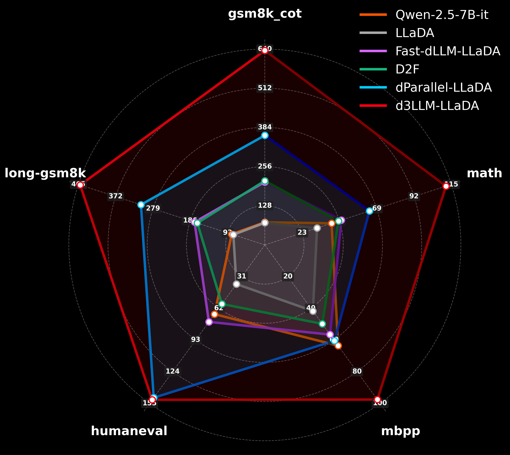
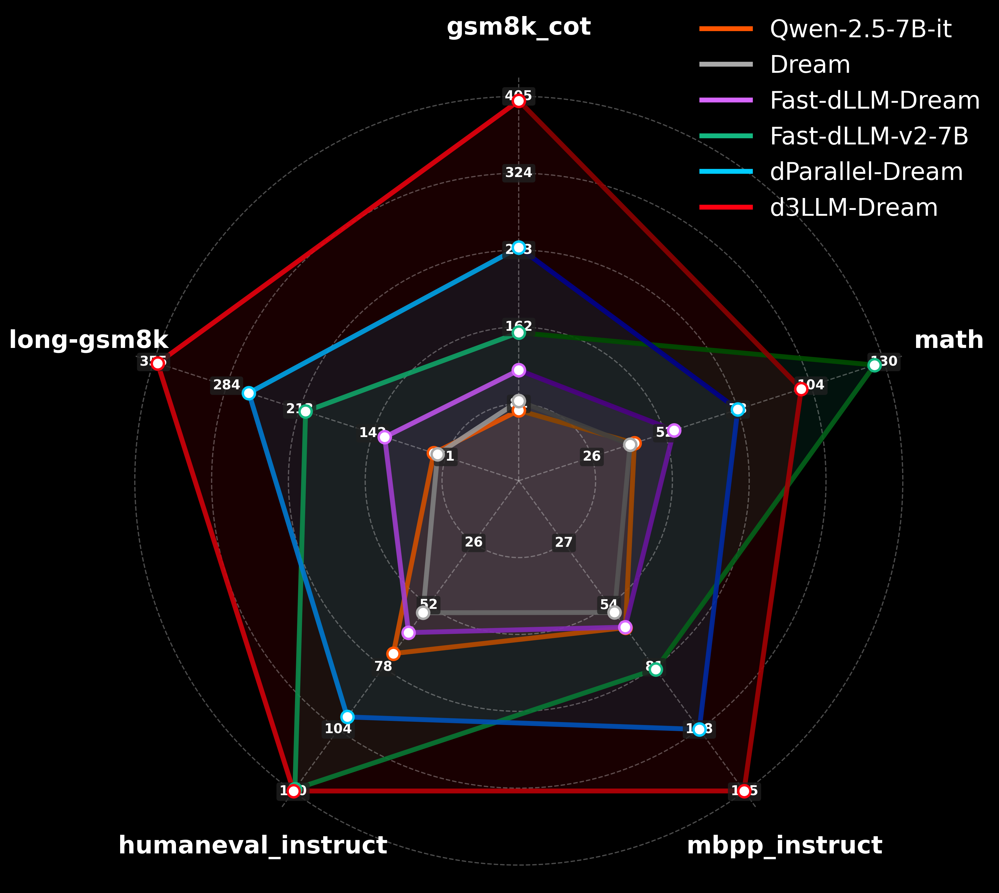
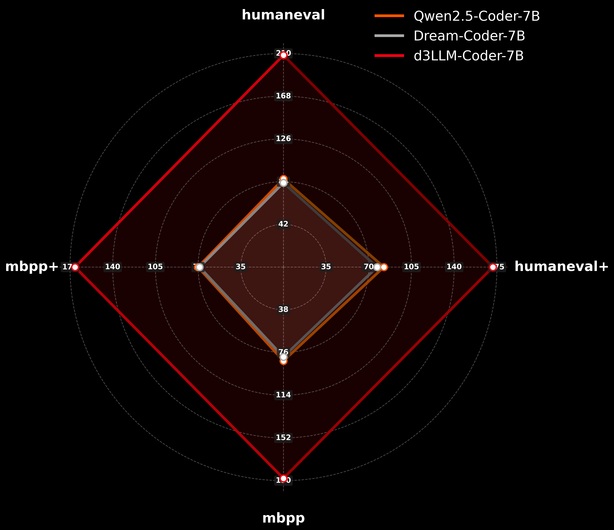

+++
title = "d3LLM: Ultra Fast dLLM using Pseudo-Trajectory Distillation 🚀"
date = 2025-11-22T12:00:00-08:00
authors = ["Yu-Yang Qian", "Junda Su", "Peiyuan Zhang", "Lanxiang Hu", "Peng Zhao", "Hao Zhang"]
author = "Yu-Yang Qian, Junda Su, Peiyuan Zhang, Lanxiang Hu, Peng Zhao, Hao Zhang"
ShowReadingTime = true
draft = false
[socialIcons]
    [[socialIcons.icon]]
      name = "twitter"
      url = "https://twitter.com"
    [[socialIcons.icon]]
      name = "github"
      url = "https://github.com/hao-ai-lab/text-diffusion"
[cover]
      image = "/img/dllm_demo.gif"
      alt = "d3LLM: Ultra Fast dLLM using Pseudo-Trajectory Distillation"
      caption = "d3LLM: Ultra Fast dLLM using Pseudo-Trajectory Distillation"
      hidden = true
+++



**TL;DR:** We introduce a novel recipe for building an ultra-fast diffusion language model named **_d3LLM_** (_dequeued-distillate-diffusion Large Language Model_) with negligible accuracy degradation. The d3LLM framework comprises two key components: (i) _distillation_ recipe and (ii)_decoding_ strategy.





## Introduction and Preliminary

Diffusion large language models (dLLMs) have emerged as a promising alternative to autoregressive (AR) LLMs. A key advantage of dLLMs is their use of *bidirectional attention*, which enables parallel decoding, error correction, and random-order generation—capabilities that are not feasible for AR models. Recently, several closed-source diffusion models, including [Mercury](https://arxiv.org/abs/2506.17298), [Gemini Diffusion](https://deepmind.google/models/gemini-diffusion/), and [Seed Diffusion](https://arxiv.org/abs/2508.02193), have demonstrated impressive efficiency and performance, achieving high decoding speeds and competitive results relative to AR models. In contrast, open-source diffusion language models have shown notably lower throughput, often performing even slower than AR counterparts. For example, [LLaDA](https://arxiv.org/abs/2502.09992) and [Dream](https://arxiv.org/abs/2508.15487) generate only around 20 tokens per second, whereas closed-source dLLMs exceed 1000 tokens per second.

With growing interest from the research community, an increasing number of methods have been proposed to accelerate dLLMs, including [Fast-dLLM](https://arxiv.org/abs/2505.22618), [D2F](https://arxiv.org/abs/2508.09192), [dParallel](https://arxiv.org/abs/2509.26488), [Fast-dLLM v2](https://arxiv.org/abs/2509.26328), and [dInfer](https://arxiv.org/abs/2510.08666). The previous state-of-the-art, Fast-dLLM v2, achieves about 100 tokens per second on a single A100 GPU, approximately twice the speed comparabled to AR models. In this work, we propose _d3LLM framework_, which further pushes this boundary to approximately 150 tokens per second on one A100 GPU and obtains even larger acceleration gains on more advanced GPU platforms such as H100 and B200.



## d3LLM: the Most Parallel Parallel-Decoder so far 🚀



We introduce a novel recipe for building a highly efficient and high-performing diffusion language model: **_d3LLM_** (_dequeued-distillate-diffusion Large Language Model_). The d3LLM framework comprises two key components: (i) _distillation_ recipe and (ii)_decoding_ strategy.



### (i) Pseudo-Trajectory-based Distillation Recipe

We propose a novel **trajectory-based distillation** recipe, which introduces an advanced distillation recipe aimed at improving both decoding efficiency and alignment with the teacher model's generation pattern. Specifically, it consists of the following key techniques:



- **Utilizing the Teacher dLLM's Pseudo-Trajectory (15%↑ TPF Improvement)**

    

    A fundamental challenge in distillation is the limited availability of intermediate supervision, where only prompt-response pairs are accessible, and the teacher model's final response may be suboptimal or incorrect. To address this, we propose leveraging the trajectory generated by the teacher dLLM to guide the student model.

    

    Specifically, given a prompt \$\mathbf{x}\$ and a predefined maximum output length \$n\$, we first let the teacher dLLM to generate and record its own decoding trajectory \$\\{\mathcal{T}_1,\ldots,\mathcal{T}_n\\}\$, where \$\mathcal{T}_i \in \mathbb{R}^n, \forall i \in \\{1,\ldots,n\\}\$. Rather than relying on the content of the teacher's response, we extract only the order in which tokens are **_dequeued_**, that is, the sequence in which masked tokens are predicted and revealed. This order forms what we refer to as the **_pseudo-trajectory_** of the teacher.

    

    
    To train the student model, we combine the pseudo-trajectory \$\\{\mathcal{T}_1,\ldots,\mathcal{T}_n\\}\$ with the ground-truth prompt-response pair \$(\mathbf{x}, \mathbf{y})\$ and construct a _noisy sequence_ \$\widetilde{\mathbf{y}} \in \mathbb{R}^n\$ that simulates teacher's intermediate state during the decoding process. Formally, let \$t \in [0, 1]\$ denote the mask ratio, and let \$w = \\{s, s+1, \ldots, s + k\\}\$ be a decoding window of length \$k\$ starting at position \$s\$, the noisy sequence \$\widetilde{\mathbf{y}}\$ is defined as

    $$[\widetilde{\mathbf{y}}]_i= \begin{cases}[\mathbf{y}]_i & \text { if } i \leqslant s \text {  or  }\left[\mathcal{T}_{s+\lceil k t \rceil}\right]_i \neq \texttt{mask}, \\ {\texttt{mask} } & \text { if } i>s+k \text { or }\left[\mathcal{T}_{s+\lceil k t \rceil}\right]_i=\texttt{mask},\end{cases}$$

    where \$\texttt{mask}\$ is the special mask token ID, and \$[\cdot]_i\$ denotes the \$i\$-th token in the trajectory sequence. By training the student dLLM on this noisy input by requiring it to predict the labels of the masked tokens, the model learns to unmask tokens sequentially in a manner aligned with the teacher's decoding order. This leads to smoother and more efficient token generation, yielding a **15% improvement in TPF** compared to strategies that use random masking.





- **Progressive Noise Level (Further get 18%↑ TPF Improvement)**

    

  Rather than applying a fixed masking ratio throughout training, we introduce a _progressive noise schedule_ by gradually increasing the mask ratio \$t\$ from 0.0 to 0.8 during the training process. This dynamic adjustment encourages the model to learn from easier to harder decoding scenarios in a curriculum-like manner, thereby enhancing its robustness and decoding efficiency. Empirically, this strategy further improves the model's tokens-per-forward (TPF) by approximately **18%** compared to using a fixed mask ratio.



- **Progressive Window Size (Further 8%↑ TPF Improvement)**

    

  We also employ a _progressive window size_ during training: instead of fixing the decoding window length \$k\$, we gradually increase it from 16 to 32 during the training process. This allows the model to adapt to increasingly larger context spans, facilitating smoother distillation process and stable token generation. This approach leads to an additional **8% improvement in TPF** compared to a constant window size.

### (ii) Multi-Block Decoding Strategy



In addition to the novel distillation recipe, we also introduce an efficient decoding mechanism tailored for dLLM, designed to maximize parallelism across multiple-block decoding. Our decoding strategy includes the following components:





- **Entropy-Based Multi-Block Parallel Decoding (20%↑ TPF Improvement)**

    

  Inspired by the approach in [D2F](https://arxiv.org/abs/2508.09192), we propose an _entropy-based multi-block decoding_ method. Unlike conventional diffusion decoding, which operates strictly within a single block, our method enables decoding of both the current and future blocks in parallel. We select tokens to decode based on entropy threshold, in which lower-entropy (more confident) predictions across blocks are first to be unmasked. This strategy significantly enhances decoding efficiency and increases TPF by approximately **20%**.





- **Multi-Block Decoding with KV-Cache and Refresh (20%↑ TPS under Long Contexts)**

    

  To further improve decoding throughput, particularly in long-context settings, we incorporate a _KV-cache_ mechanism alongside a periodic _KV-refresh_. Specifically, after completing each block, we delay for 1–2 iterations to store the block's key-value cache. Simultaneously, we perform a full forward pass without caching to refresh all prior KV caches. This hybrid strategy maintains decoding accuracy while significantly improving TPS by approximately **20%** in long-context scenarios.





- **Early Stopping on EOS Token (5%↑ TPF Improvement)**

  We implement an **early stopping mechanism** that halts decoding once the end-of-sequence (EOS) token is generated. This simple yet effective optimization reduces unnecessary computation and yields a **5% improvement in TPF** on average.



## Benchmark Results

By combining our distillation recipe with the proposed decoding strategy, our d3LLM framework surpasses previous state-of-the-art methods on both TPF and TPS, without sacrificing accuracy. The results are presented below.

**Implementation Details.** Our approach begins with a semi-autoregressive diffusion model (either LLaDA or Dream) with a block size of 32 as the teacher model. This setup enforces causal dependencies between blocks while enabling parallel decoding of multiple tokens within each block. For fair comparison, we adopt the same distillation dataset as dParallel, which includes approximately 122k samples for Dream and 92k samples for LLaDA, sourced from the PRM12K, AceCode, GSM8K (training split), and Numina-Math datasets. The learning rate is set to 2e-5. We train six epochs for LLaDA and three for Dream. For d3LLM-Coder, we use _Dream-Coder-7B-Instruct_ as the teacher dLLM and collect 120k samples from the Ling-Coder-SFT and AceCode datasets, along with a small amount of math-reasoning data. More implementation details can be found in our [code repo](https://github.com/hao-ai-lab/text-diffusion).

**Benchmark Datasets.** We present comprehensive benchmark results across five representative tasks: GSM8K-CoT (chain-of-thought reasoning), MATH (mathematical problem solving), HumanEval (code generation), MBPP (Python programming), and a long-context math reasoning task (5-shot GSM8K reasoning, with a prompt length ≈ 1000). These evaluations assess the performance of our proposed model, d3LLM, against state-of-the-art diffusion-based language models using three key metrics: tokens per forward (TPF), accuracy, and our proposed Accuracy Under Parallelism (AUP).

Our experiments are conducted on three foundational diffusion models: LLaDA, Dream, and Dream-Coder. From these models, we derive three distilled variants—d3LLM-LLaDA, d3LLM-Dream, and d3LLM-Coder—each trained using the same trajectory-based distillation procedure and multi-block decoding strategy described earlier. For the LLaDA-based model, we compare *d3LLM-LLaDA* with *vanilla LLaDA*, *Fast-dLLM-LLaDA*, *D2F*, and *dParallel-LLaDA*.
For the Dream-based model, we compare *d3LLM-Dream* with *vanilla Dream*, *Fast-dLLM-Dream*, *Fast-dLLM-v2-7B*, and *dParallel-Dream*.

We use the AUP (*Accuracy Under Parallelism*) score as the primary evaluation metric. Details of AUP and additional experimental results are provided in [this blog](../text-diffusion). All experiments were conducted on NVIDIA H100 GPUs. For short, we present a radar plot of AUP scores on different datasets as below.

<figure>

  
  
  

<figcaption style="text-align: center; color: #808080; margin-top: 10px;">Radar plot of AUP scores comparing (a) LLaDA-based, (b) Dream-based, and (c) Coder models.</figcaption>
</figure>

**Results on Different Models and Datasets.** As shown by the results above, the proposed distillation recipe and multi-block decoding strategy are robust and improve efficiency across various domains. Specifically, our d3LLM achieves the highest AUP score, and accelerates the vanilla LLaDA by approximately 5–10× on TPF across different tasks. Remarkably, we note that for Fast-dLLM-v2, the accuracy scores on Math and HumanEval are notably higher than those of other diffusion models derived from Dreams. We suspect that this stems from the fact that Fast-dLLM-v2 is finetuned directly from Qwen-2.5-7B with an additional 1B tokens (i.e., the LLaMA–Nemotron post-training dataset). In contrast, our d3LLM-Dream is distilled based on the vanilla Dream and uses only 60M additional tokens.

**Wall-Clock Speed Comparison.** We further evaluate different methods on multiple hardware platforms, including H100 and A100 GPUs, to measure their wall-clock throughput (measured by tokens per second, TPS) and speedup. The results are presented below.
For the *LLaDA-8B-Instruct*, we report speed (TPS) and accuracy on GSM8K-CoT dataset.



|                 | H100's TPS | A100's TPS | Acc   |
|-----------------|:----------:|:----------:|:-----:|
| Qwen-2.5-7B-it  | 57.32      | 50.36      | 74.10 |
| LLaDA           | 27.89      | 19.15      | 72.55 |
| Fast-dLLM-LLaDA | 114.29     | 79.14      | 74.68 |
| D2F             | 102.13     | 76.24      | 73.24 |
| dParallel-LLaDA | 172.23     | 105.85     | 72.63 |
| **d3LLM-LLaDA** | **280.97** | **180.23** | **73.10** |



For the *Dream-7B-Instruct*, we again report speed and accuracy on GSM8K-CoT dataset.



|                 | H100's TPS | A100's TPS | Acc   |
|:---------------:|:----------:|:----------:|:-----:|
| Qwen-2.5-7B-it  | 57.32      | 50.36      | 74.10 |
| Dream           | 27.62      | 8.32       | 83.94 |
| Fast-dLLM-Dream | 77.25      | 51.55      | 79.00 |
| Fast-dLLM-v2-7B | 150.01     | 109.68     | 77.48 |
| dParallel-Dream | 168.36     | 80.23      | 82.12 |
| **d3LLM-Dream** | **235.34** | **128.19** | **81.86** |



To summarize, across both models, our d3LLM framework achieves higher TPF and maintains the highest AUP score across all four tasks with negligible performance degradation. It delivers up to a **5× speedup** over autoregressive decoding (Qwen-2.5-7B-it) on H100 GPUs, and approximately **3× speedup** on A100 GPUs. 
Note that all experiments are conducted using the HuggingFace inference backend. We leave system-level optimizations including GPU kernel fusion and integration with vLLM, to future work for further TPS improvements

All our distillation code, data, model weights, and benchmark evaluation code are available at [https://github.com/hao-ai-lab/text-diffusion](https://github.com/hao-ai-lab/text-diffusion). The full paper about AUP and our d3LLM framework will be released soon. Stay tuned!
.